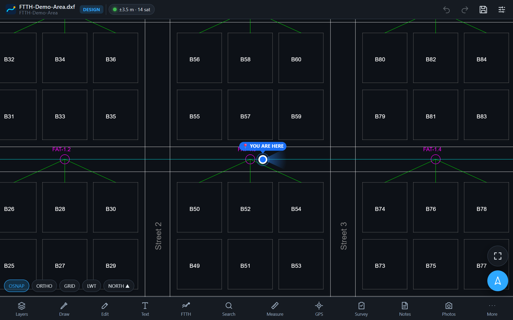
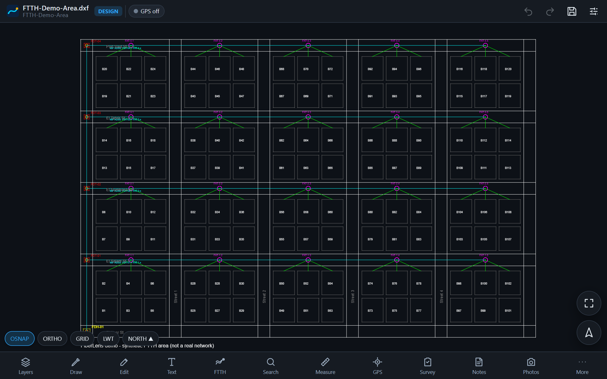
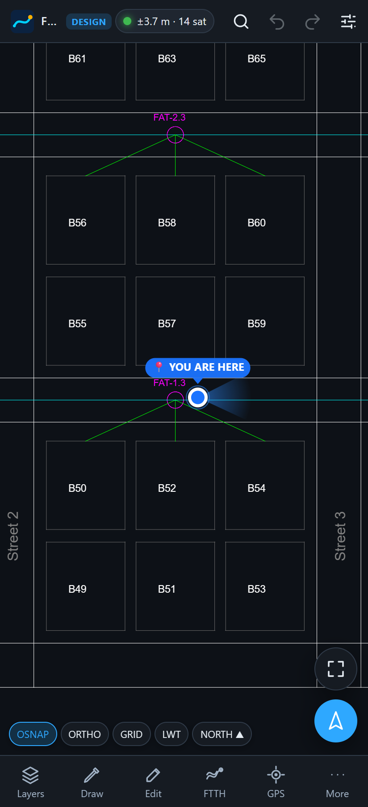

# FiberLens — Smart CAD + FTTH Field Engineering Platform


**Live web app:** https://fiberlens.pages.dev · mirror: https://ahshika.github.io/FiberLens/

**Your DWG is the map.** FiberLens opens DWG/DXF drawings on Android tablets/phones and the
desktop browser, edits them like a CAD program, puts your live GPS position *inside* the drawing,
and understands FTTH networks (FAT/FDT/FDH/closures/cables/cores/splitters) for field work,
as-built, maintenance, BOQ and reports — fully offline.

> 🇪🇬 **بالعربي:** FiberLens هو برنامج CAD ذكي لمشاريع الفايبر FTTH. يفتح ملفات DWG/DXF ويعرضها
> بدقة على الموبايل والتابلت، ويسمح بالتعديل والرسم والكتابة، ويعرض موقعك الحالي **📍 YOU ARE HERE
> داخل ملف الـCAD نفسه** بدون أي خريطة منفصلة. يفهم عناصر الشبكة (FAT / FDT / FDH / Closure /
> الكابلات / الشعيرات / الـSplitters)، ويعمل Trace للمسار حتى الـOLT، ويدعم المسح الميداني والصور
> والملاحظات والـAs-Built والصيانة والـBOQ والتقارير — وكل ذلك يعمل بدون إنترنت.

<p align="center">
  
</p>

| Whole drawing (WebGL2, layers, FTTH objects) | On a phone in the field |
|---|---|
|  |  |

<sub>Screenshots use [`docs/samples/FTTH-Demo-Area.dxf`](docs/samples/FTTH-Demo-Area.dxf), a synthetic drawing (not a real network) with the built-in GPS simulator. Open it in the app to try everything without your own files.</sub>

## Quick start

```bash
npm install
npm run dev          # http://localhost:5180
npm test             # 27 unit tests (geometry, georeferencing, NMEA, DWG/DXF round trip)
npm run build        # production web build → dist/
```

Android APK (needs Android SDK + JDK 21):

```bash
npm run build && npx cap sync android
cd android && ./gradlew assembleDebug      # → android/app/build/outputs/apk/debug/app-debug.apk
```

A ready-to-install APK is on the [Releases page](https://github.com/Ahshika/FiberLens/releases/latest).

## What is inside

| Area | Highlights |
|------|-----------|
| **CAD engine** | acad-ts (MIT) in a Web Worker: DWG R14 → 2018+ (AC1014–AC1032), DXF R12+. Layers, blocks + attributes, text/MText, dimensions, hatches (solid + pattern), splines, ellipses, leaders/multileaders, linetypes, lineweights, true colour, transparency, wipeouts, GEODATA. |
| **Renderer** | WebGL2, chunked buffers relative-to-centre (no jitter at UTM coordinates), instanced line quads with linetypes & lineweights in the shader, layer state in a GPU texture (toggle layers without rebuild), incremental chunk rebuild on edit, LOD text overlay. 85k-entity FTTH drawing: ~550k segments, 23 MB GPU, < 1 ms GPU frame. |
| **Viewer** | Zoom/pan/pinch, fit, zoom to object/layer/GPS, pick, window/crossing, grips, grid, object snap (end/mid/center/quadrant/intersection/perpendicular/node/insert/nearest/GPS), ortho, cursor coordinates, typed input (`x,y` `@dx,dy` `@d<a`). |
| **Editing** | Move, Copy, Paste, Delete, Rotate, Mirror, Scale, Stretch, Trim, Extend, Offset, Fillet (incl. whole polyline), Chamfer, Explode, Join, Break, PEdit (close/open/reverse/add/remove vertex/width), Match properties, Properties panel, unlimited undo/redo. |
| **Drawing & text** | Line, Polyline (with arcs), Arc, Circle, Rectangle, Triangle, Polygon, Ellipse, Revision cloud, Arrow, Freehand, Point, Hatch, Leader; Text, MText, edit any existing text / block attribute; free colour picker, layer, linetype, width, transparency, fill, rotation, size. |
| **Layers** | Show/hide, freeze, lock, colour, linetype, lineweight, transparency, search, new, rename, delete (if unused), isolate, move objects between layers, zoom to layer. |
| **GPS** | Phone GNSS (also external receivers via Android mock location), NMEA over USB/serial and Bluetooth LE (RTK fix types, satellites, HDOP), simulator. YOU ARE HERE marker with accuracy circle & heading cone; Locate, Follow, North-up, Heading-up; tracking sessions (GPX export). |
| **Georeferencing** | Drawing CRS (UTM, Egyptian Red/Blue/Purple belts, custom proj4), automatic CRS detection from a GPS fix, GEODATA import, 9-step calibration wizard: translation / Helmert / affine least squares with per-point residuals and RMS. |
| **FTTH** | Smart objects (OLT, ODF, FDH, FDT, FAT, FTB, Cabinet, Manhole, Handhole, Pole, Closure, Splitter, Customer, Building, Joint), rule-based detection from layers/blocks/attributes, smart cables with automatic length, TIA-598 core management, splitters 1:2…1:64 with port mapping, splices, Trace (upstream to OLT / downstream to customers / single fibre), FTTH search, nearest object + navigation over the CAD. |
| **Field** | Survey sessions (GPS point, photo, video, voice, note, object, damage, inspection, installation), photos linked to objects with GPS/CAD/time, notes pinned to locations, maintenance log, faults with impact trace, QR codes (generate, label sheets, scan → object card, `fiberlens://` deep links). |
| **As-Built & versions** | Design / As-Built modes, versions V1…Vn with author, date, change summary, restore; Design vs As-Built compare on the drawing (added/modified/removed) and for FTTH data. |
| **Outputs** | DWG (edits merged into the original), DXF, PDF (raster or vector), PNG, JPG, CSV, Excel, GeoJSON, KML, KMZ, GPX; BOQ and 10 reports. |
| **Platform** | Offline-first IndexedDB storage, file safety (immutable original + project copy + journal), local accounts & 5 roles, per-project roles, audit log, AES-GCM encrypted backups and sync payloads, optional cloud sync (reference server in `server/`). |

## Documentation

* [Architecture](docs/01-ARCHITECTURE.md) · [Technology & CAD engine choice](docs/02-TECH-STACK.md) ·
  [Data model](docs/03-DATA-MODEL.md) · [UI/UX](docs/04-UI-UX.md) · [Modules & phases](docs/05-ROADMAP.md) ·
  [Sync](docs/06-SYNC.md) · [User guide (عربي / English)](docs/07-USER-GUIDE.md) · [Status & limits](docs/08-STATUS.md)
* Third-party licences: [THIRD_PARTY_NOTICES.md](THIRD_PARTY_NOTICES.md)
